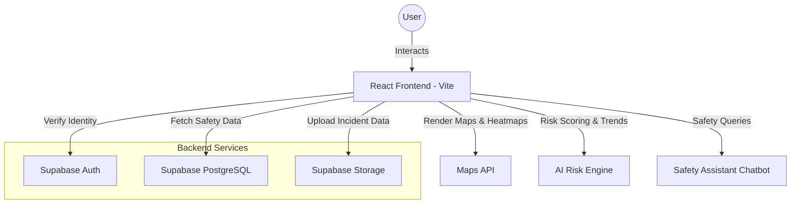

# 🌆 SafeScout — Place-First Urban Safety Intelligence Platform

## Project Info

**Live URL**: https://safe-scout.vercel.app/  
**Repository**: https://github.com/your-org/SafeScout

SafeScout is a **place-first, explainable urban safety intelligence platform** that helps people decide **when and where it is safer to move** using time-aware crime trends, interactive heatmaps, and an AI-powered safety assistant.  
This is a **decision-support tool**, not an emergency service.

## What does this project do?

SafeScout enables users to:

- Search any **city / locality / area**
- Instantly view an **area safety summary**
- Explore **interactive crime heatmaps**
- Understand **time-based risk patterns**
- Compare localities using **city safety rankings**
- Ask questions via a **context-aware safety assistant chatbot**

## Why is this project useful?

Urban safety information today is often static, non-explainable, and hard to act on.  
SafeScout improves this by providing:

- **Place-first entry flow** (search before map)
- **Safety score (0–100)** with clear reasoning
- **Time-aware risk analysis** (hour / day / weekend)
- **Explainable insights**, not black-box labels
- **Trust signals** such as data freshness
## How can I get started?

### Prerequisites

- Node.js (v18 or higher)
- npm or bun
- A Supabase project
- A Maps API key


## 📐 Simple Architecture Overview

SafeScout uses a **modern, serverless architecture** for scalability and performance.



### Installation

```sh
# Step 1: Clone the repository
git clone https://github.com/your-org/cityshield.git

# Step 2: Navigate to the project directory
cd cityshield

# Step 3: Install dependencies
npm install

# Step 4: Start the development server
npm run dev
```

---

## 💻 Source Code Structure

The project follows a clean, modular directory structure for ease of navigation and maintenance:
- `src/components/`: Reusable UI elements and layout components.
- `src/contexts/`: Global state management for languages and authentication.
- `src/pages/`: Main application views (Home, Report, Analytics, etc.).
- `src/lib/`: Custom utilities and AI logic (Hashing, Supabase clients).
- `public/`: Static assets and icons.

---
## ⚡ Setup Instructions

### Prerequisites
-   **Node.js** (v18 or higher)
-   **npm** or **bun**
-   A **Supabase** project (free tier works)
-   A **Google Maps API Key**

### Steps

1.  **Clone the Project**
    ```bash
    git clone https://github.com/jaimanv/safe-scout
    cd safe-scout
    ```

2.  **Install Dependencies**
    ```bash
    npm install
    ```

3.  **Configure Environment**
    Create a `.env` file in the root and add your details:
    ```env
    VITE_SUPABASE_URL=your_supabase_url
    VITE_SUPABASE_ANON_KEY=your_supabase_anon_key
    VITE_GOOGLE_MAPS_API_KEY=your_google_maps_key
    ```

---


## 📦 Build Reproducibility Instructions (Mandatory)

To ensure judges can successfully run and build the project exactly as intended, follow these steps:

1.  **Clean Install**: Always use `npm install` to ensure the `package-lock.json` is respected.
2.  **Build for Production**:
    ```bash
    npm run build
    ```
    *This will generate a `dist/` folder containing the optimized assets.*
3.  **Local Preview**:
    ```bash
    npm run preview
    ```
    *This runs the production build locally to verify all assets and routes work as expected.*
4.  **Verification**: Navigate to `http://localhost:4173/` (default Vite preview port) to interact with the verified production build.
---

## What technologies are used?

This project is built with:

- React 18
- TypeScript
- Vite
- Tailwind CSS
- Supabase (Auth, Database, Storage)
- Maps API
- Recharts

## Key Features

### Place-First Entry Flow
- Search-first landing page
- Auto-suggestions and recent searches
- Clear **Analyze Safety** CTA

### Area Intelligence Summary
- Area name
- Safety score (0–100)
- Risk level (Low / Medium / High)
- Safest time today
- Nearest police station (distance)

### Interactive Crime Heatmap
- Full-screen heatmap
- Filters by crime type and time
- Clickable regions with statistics
- Data freshness indicator

### 👮Crime Trend Dashboard
- Crime increase/decrease graphs
- Animated daily heatmap movement
- Seasonal and event-based insights

### City Safety Rankings
- Top 10 Safest Areas
- Top 10 High-Risk Areas
- Most Improved Areas
- Most Declined Areas

### 🦺 Safety Assistant Chatbot
- Natural language safety queries
- Time-aware risk explanations
- Safer time and area suggestions
- Non-authoritative decision support

## Who maintains this project?

Maintained by  **jaiman v**.

Contributions are welcome.  
Please read `CONTRIBUTING.md` before submitting pull requests.

## 📄 License

This project is licensed under the **MIT License**.  
See the `LICENSE` file for details.


